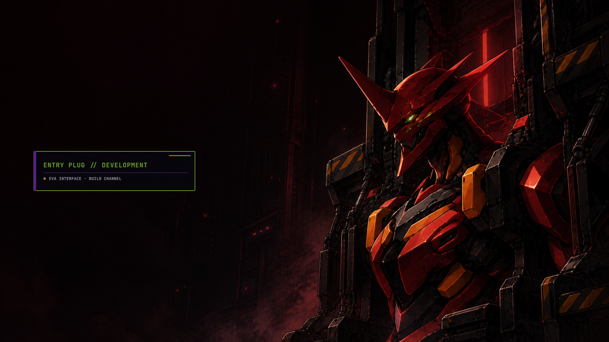
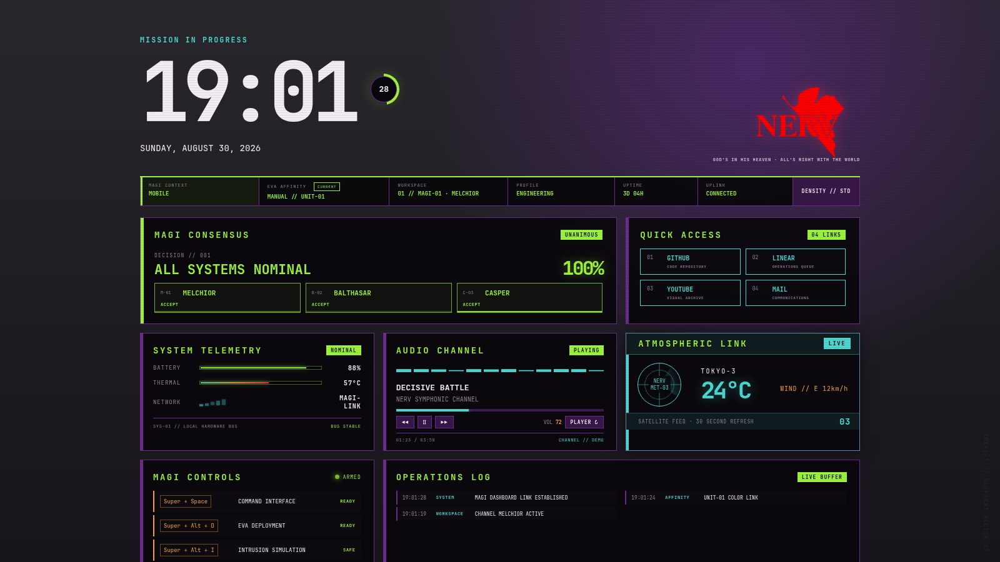
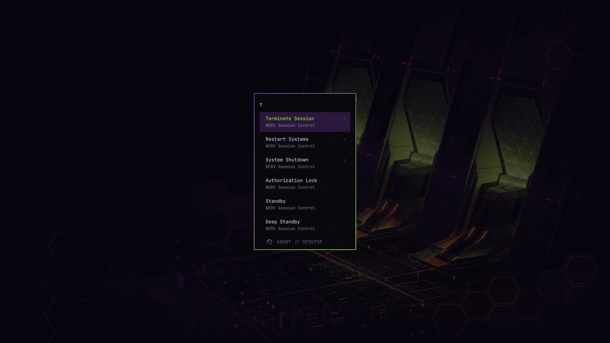
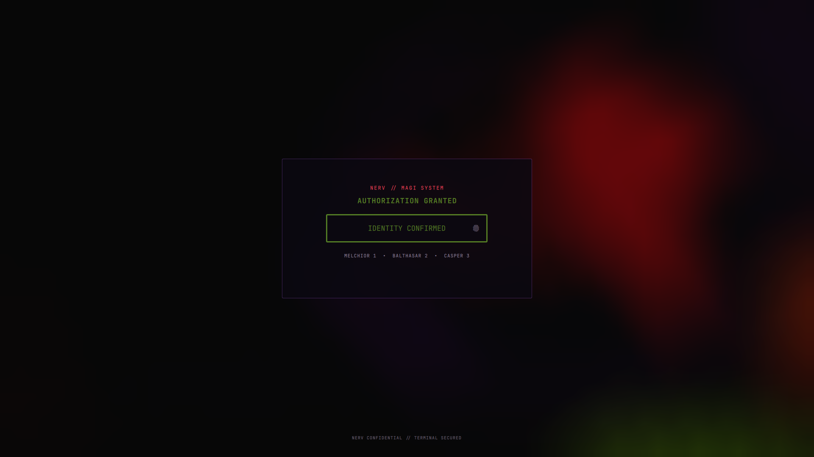
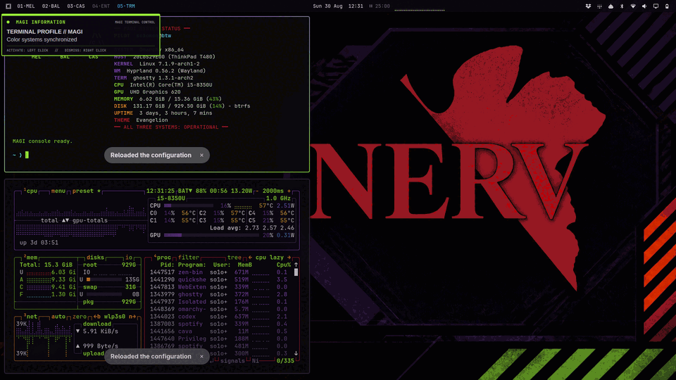

# Evangelion Omarchy Rice

[](https://github.com/so1omon563/evangelion-omarchy-rice/actions/workflows/validate.yml)

Complete Neon Genesis Evangelion desktop environment for Omarchy, including
seven wallpapers, EVA affinity palettes, MAGI shell plugins, safety telemetry,
workspace identities, terminal profiles, menus, sounds, and operational tools.



## Gallery

| MAGI start page | Session controls |
|---|---|
|  |  |

| Lock screen | Terminal profile switching |
|---|---|
|  |  |


> Unofficial fan project. Not affiliated with or endorsed by the owners of
> *Neon Genesis Evangelion*. See [ASSETS_LICENSE.md](ASSETS_LICENSE.md) before
> redistributing wallpaper assets.

## Install

This release targets Omarchy with Hyprland. Before changing any configuration,
run the read-only dependency check:

```bash
./check-dependencies.sh
```

The report separates three levels:

- **Required** — source-validation tools and the active Omarchy desktop. The
  installer stops before its first write if one is missing.
- **Recommended** — Ghostty, Neovim, Fastfetch, and btop provide the complete
  reference experience, but are not required for the base theme.
- **Optional** — feature-specific integrations such as media controls,
  Tailscale, clipboard actions, power profiles, and multi-monitor screensaver
  IPC. A missing optional tool disables only its listed integration.

Every missing group includes an actionable Arch/Omarchy package command. The
canonical machine-readable inventory is [dependencies.tsv](dependencies.tsv).
After reviewing the report and repository, run:

```bash
./install.sh --apply
```

The installer snapshots every file it manages before changing it, records the
snapshot under `~/.local/state/evangelion-rice/install-backups/`, installs the
theme and integrations, activates the user services, and runs validation.
Running it again is supported and creates a new rollback point.

## Validate

```bash
./validate.sh
```

Validation is non-destructive. It checks scripts, JSON, Lua, custom hotkeys,
the dependency manifest, widget sources, live binaries, the bar layout, and
Hyprland configuration. CI can check only repository tooling with
`./check-dependencies.sh --source-only`.

## Roll back

Restore the most recent installation snapshot:

```bash
./rollback.sh
```

Or provide a specific snapshot directory. Rollback only restores or removes
paths listed in that snapshot's manifest.

See [HOTKEYS.md](HOTKEYS.md) for the full control reference and [AUDIT.md](AUDIT.md)
for release verification.

## License

Software and configuration source are available under the MIT license. Image
assets are excluded from that grant; see [ASSETS_LICENSE.md](ASSETS_LICENSE.md)
and [theme/ARTWORK.md](theme/ARTWORK.md).
