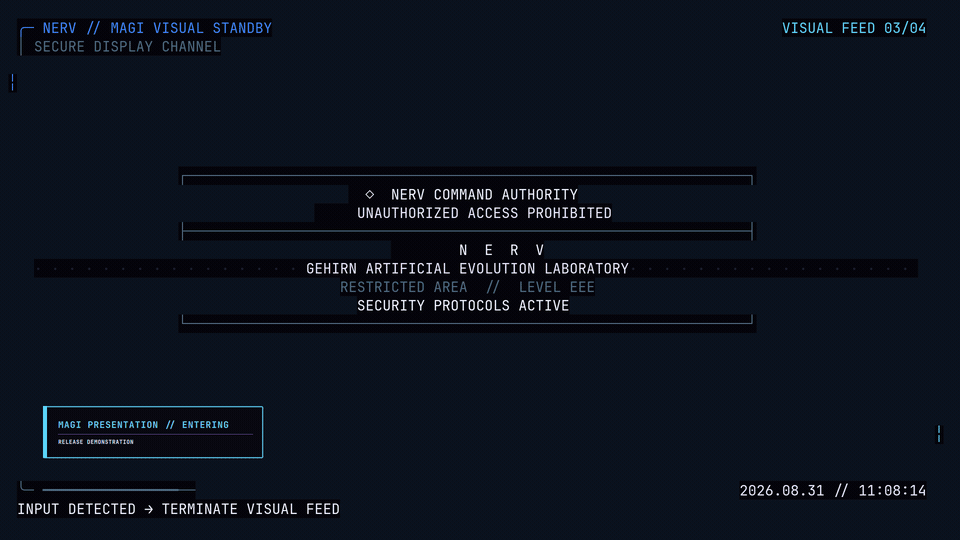
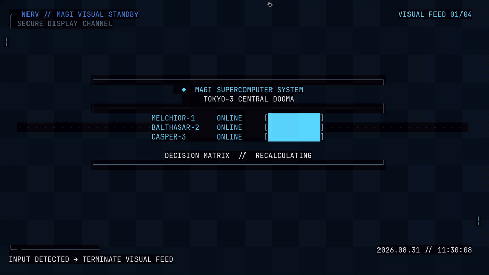
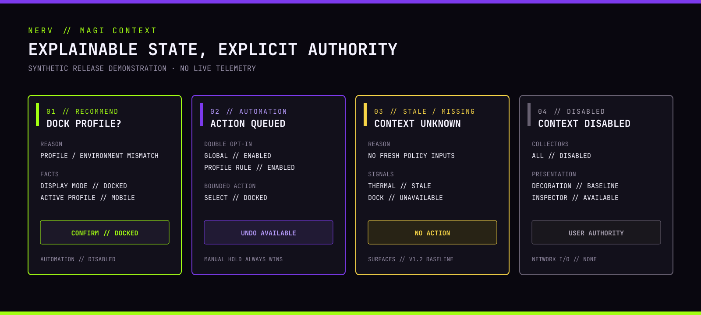

# Evangelion Omarchy Rice

[](https://github.com/so1omon563/evangelion-omarchy-rice/actions/workflows/validate.yml)

> **v1.4.0:** the distribution release adds a standalone gallery-ready
> theme, reproducible complete-suite archives, explicit Arch user activation,
> cross-channel conflict/rollback tests, and clear selection and maintainer
> workflows. MAGI plugins remain coordinated suite-internal components. The
> v1.3 desktop baseline—including affinity-aware icons, restart-free palette
> refresh, semantic start-page state, explainable local context, and bounded
> opt-in automation—remains intact. It is validated by source
> CI, an isolated clean-user lifecycle, transactional install/rollback tests,
> privacy/interruption regressions, the responsive display matrix, and the reference T480. Community compatibility reports are
> welcome through [BETA_TESTING.md](BETA_TESTING.md), but are not a release gate.

> **v1.3.1:** remains the stable upgrade baseline for affinity-aware native
> icons, restart-free palette refresh, semantic start-page state, and cache-safe
> Zen/Chromium behavior; v1.4 preserves and revalidates those contracts.

An unofficial *Neon Genesis Evangelion* desktop environment for Omarchy:
seven wallpapers, EVA affinity palettes, MAGI shell plugins, responsive menus
and overlays, terminal profiles, safety telemetry, sounds, and operator tools.


| MAGI start page | Session controls |
|---|---|
|  |  |

| Lock screen | Terminal profiles |
|---|---|
|  |  |

| Full motion | Reduced motion |
|---|---|
|  |  |




> This is an unofficial fan project, unaffiliated with the rights holders.
> Software is MIT-licensed; artwork has separate terms. Read
> [ASSETS_LICENSE.md](ASSETS_LICENSE.md) before redistributing assets.

## Supported environment

| Component | Supported range | Verified reference |
|---|---|---|
| Omarchy | `>=4.0.0, <5.0.0` | 4.0.1-1 |
| Hyprland | `>=0.56.0, <0.57.0` | 0.56.2-1 |
| Architecture | x86_64 | ThinkPad T480, x86_64 |
| Session | Active Wayland/Hyprland session for installation activation | Omarchy |
| Displays | 1280×720 presentation minimum; 320×480 overlay minimum | 7 automated profiles from 1×–2× |
| Terminals | Ghostty, Alacritty, Foot, or Kitty | Ghostty and Foot |
| Shell integration | Bash, Zsh, or Fish; optional | Bash |
| Browser | Current XDG/Omarchy default | Zen and Chromium-compatible launchers |

x86_64 is the supported release architecture. Other Linux architectures are
not intentionally blocked by source validation, but remain unverified. The
original T480 is a reference machine—not a hardware requirement. Battery-less,
multi-battery, Intel, AMD, generic thermal, missing-sensor, and optional-tool
fallbacks are implemented. See [RESPONSIVE.md](RESPONSIVE.md) for the exact
display matrix and [TESTING.md](TESTING.md) for what CI proves.

Support covers the version ranges above and reproducible repository behavior.
Third-party themes, arbitrary shell forks, and hardware-specific vendor tools
are best-effort. Include `./preflight.py --json` and `./validate.sh` output in a
bug report.

## Quick start

Choose the channel before installing. For only the palette and wallpapers:

```bash
omarchy theme install https://github.com/so1omon563/omarchy-evangelion-theme.git
```

For the complete MAGI desktop, download the archive and matching checksum from
the [latest GitHub release](https://github.com/so1omon563/evangelion-omarchy-rice/releases/latest),
verify them, extract, and run from an active Omarchy Hyprland session:

```bash
sha256sum --check evangelion-omarchy-rice-1.4.1.tar.gz.sha256
tar -xzf evangelion-omarchy-rice-1.4.1.tar.gz
cd evangelion-omarchy-rice-1.4.1
./scripts/build-release verify-root .
./preflight.py
./install.sh --dry-run --preset default
./install.sh --apply --preset default
omarchy theme set evangelion
./validate.sh
```

Contributors and testers may instead follow the moving Git checkout:

```bash
git clone git@github.com:so1omon563/evangelion-omarchy-rice.git
cd evangelion-omarchy-rice
./preflight.py
./install.sh --dry-run --preset default
./install.sh --apply --preset default
omarchy theme set evangelion
./validate.sh
```

Use the HTTPS clone URL if SSH is not configured. Arch users can use the
checksum-pinned `PKGBUILD` attached to the release and the explicit activation
workflow in [ARCH_PACKAGING.md](ARCH_PACKAGING.md); AUR publication is deferred.
Always review the dry-run;
the default preset replaces complete Omarchy shell and Hyprland configuration
files after confirmation. The preflight is read-only and stops unsafe installs
before the first backup or write.

Presets:

- `minimal`: theme and command-line tools only.
- `default`: minimal plus shell, Hyprland, start page, and user services.
- `full`: default plus Fastfetch/Neovim extras and detected-shell integration.

Select individual components with `--components`, override shell detection with
`--shell bash|zsh|fish`, or use `--no-shell-integration`. See
[INSTALL.md](INSTALL.md) for prerequisites, package commands, component/path
effects, transaction behavior, and first-run verification.
Use [DISTRIBUTION_GUIDE.md](DISTRIBUTION_GUIDE.md) to choose between “just the
look,” a complete release, a development checkout, and managed Arch packaging.
See [DISTRIBUTION.md](DISTRIBUTION.md) for their normative ownership contract.

## Configuration

Personal settings live in `~/.config/omarchy/evangelion.json`, which the
installer creates once and preserves on upgrades. Terminal, editor, shell,
project path, deployment, presentation, browser selection, weather, operating
profiles, global motion level, local MAGI context controls, thermal thresholds,
and optional integrations are documented in
[CONFIGURATION.md](CONFIGURATION.md). The complete context inputs, privacy
boundary, precedence, reasons, recommendations, automation controls,
accessibility behavior, and performance contract are in [CONTEXT.md](CONTEXT.md).

Distribution boundaries, the complete plugin audit, and the deliberately small
optional-integration contract are documented in [DISTRIBUTION.md](DISTRIBUTION.md),
[PLUGIN_AUDIT.md](PLUGIN_AUDIT.md), and [MAGI_RUNTIME.md](MAGI_RUNTIME.md).
Exact-tag suite archives, checksums, provenance, and offline installation are
covered in [RELEASE_ARTIFACTS.md](RELEASE_ARTIFACTS.md).
Arch package ownership and explicit per-user activation are covered in
[ARCH_PACKAGING.md](ARCH_PACKAGING.md).
Supported channel transitions, conflicts, and CI evidence are covered in
[CROSS_CHANNEL.md](CROSS_CHANNEL.md).
The synchronized release, theme-gallery, packaging, and privacy review workflow
for contributors is in [MAINTAINING.md](MAINTAINING.md).

The browser always follows `omarchy launch browser`; no browser executable is
hard-coded. Cava is an independent `evangelion.cava` bar plugin and hides when
Cava is unavailable. Neon Overdrive is a separately selected compatibility
component and is never installed by a preset.

For controls and keybindings, see [HOTKEYS.md](HOTKEYS.md).

## Upgrade, rollback, and removal

If custom shell or Hyprland configuration cannot load, `magi-recovery enter`
activates a stock-only static layout after taking an exact local snapshot.
Use `Super + Alt + R` when the compositor is responsive, or run it from a TTY;
`magi-recovery exit` restores the prior configuration. See
[HOTKEYS.md](HOTKEYS.md#static-recovery-mode) for the complete recovery path.

For v1.5 configuration changes, run `magi-migrate preview` before applying an
upgrade. The assistant names every preserved setting and replacement and
requires `keep` or `replace` for each conflict. Interrupted applies are held for
explicit `magi-migrate recover`; see [UPGRADING.md](UPGRADING.md#guided-migration-into-v15).

Every changed target is recorded in a transaction snapshot under
`~/.local/state/evangelion-rice/install-backups/`. Failed activation or
validation automatically rolls back the active transaction.

```bash
./rollback.sh
./rollback.sh /path/to/snapshot
```

Users upgrading from v1.2 keep their selected motion mode and personal
configuration; context automation and every individual rule remain off until
explicitly enabled. Users upgrading from the original v1.0-era installation receive an automatic,
rollback-safe migration from `so1omon.*` to `evangelion.*` plugin IDs. Read
[UPGRADING.md](UPGRADING.md) before upgrading or removing a multi-transaction
installation; a rollback reverses one transaction, not the entire history.

## Troubleshooting and validation

Start with `./preflight.py --json` and `./validate.sh`.
[TROUBLESHOOTING.md](TROUBLESHOOTING.md) covers shell/plugin loading, services,
wallpapers, weather, media, Cava, sensors, and hotkey conflicts. Contributor
checks are:

```bash
./tests/installer.sh
./tests/clean-user.sh
./tests/responsive-layouts.py
./tests/motion-regression.py
./tests/motion-observe.py # optional live observation
./tests/context-regression.py
./tests/magi-extension-contract.py # internal widget state boundary
./tests/visual-regression.py --self-test # canonical privacy-safe frames and CI diffs
./tests/performance-overlay.py # opt-in aggregate developer telemetry
./tests/context-observe.py # optional live T480 observation; restores state
```

CI retains machine-readable clean-user and responsive-layout artifacts. See
[AUDIT.md](AUDIT.md) for release verification and [theme/ARTWORK.md](theme/ARTWORK.md)
for wallpaper provenance.

Release history and migration highlights are in [RELEASE_NOTES.md](RELEASE_NOTES.md).

## License

Software and configuration source are MIT-licensed. Image assets are excluded
from that grant; see [ASSETS_LICENSE.md](ASSETS_LICENSE.md).
